# RIDDC Web Volume Rendering

This project is an effor to integrate data visualization on VR and web browser technologies.
This project was developed using react-js and Aframe (webvr - threejs -webgl2)

##### Table of Contents
* [Installation](#Installation)
* [About this project](#About)
* [Live demo](#Demo)
* [Enable Mozilla Firefox VR](#FireFoxVR)

<a name="Installation"/>
## Installation

For local deployment, clone - download the repository and in the project directory run

#### `npm install`

The package manager will install all the depencies. When it is done run:

##### `npm start`

Open [http://localhost:3000](http://localhost:3000) to view it in the browser.

The page will reload if you make edits. 
You will also see any lint errors in the console.

<a name="About"/>
## About this project

WebVR Volume Rendering.

#### Introduction

A web based volume visualizer application to support scientific 3D data built on top of webgl that will facilitate the access from any web browser, plus the benefits of VR.

It was implemented using A-frame, a javascript framework easy to learn, use and deploy. It sits on top of Three.js, which is the most used library to support 3D rendering on the web, and html which is the common tool to write static web pages. A-frame follows a composed based pattern, common on game and graphics engines. Additionally, it uses node js to easy deploy the modules the application is based on.

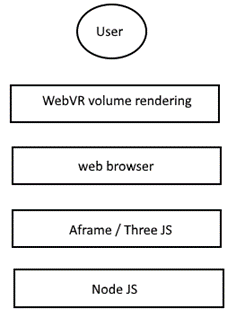

<a name="Demo"/>

#### Live Demo

[Click here for live demo](https://datasci.brown.edu/volume-vr/)

Select the data to visualize.
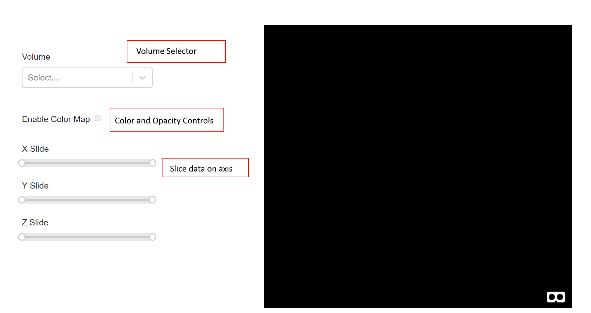

You can modify the channel-layer you want to visualize (if the data supports RBGA textures)
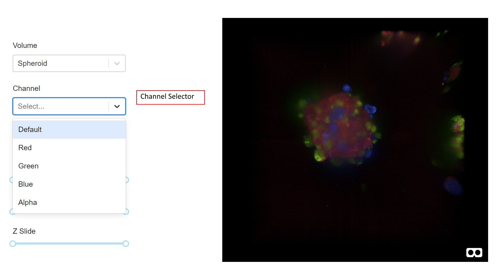

Open the color mapping - opacity transfer function option.
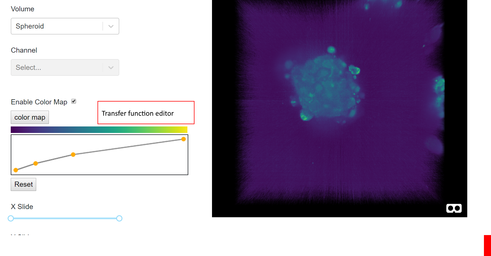

Double click on the canvas to create a new point. Left click on one of the points to remove it.

#### A-Frame Implementation

Following A-Frame’s philosophy, the application has a custom component that reads, loads and render 3D textures as volume data. To accomplish this, An 'aframe-react' entity is created and we attach our custom component:

    <Entity id="volumeCube" class="clickableMesh"   myloader={{'path_to_data'}}   position="0 0 0"/>

Althoug it can be attached to a generic aframe entity:

    <a-entity id="volumeCube"  myloader="path_to_data" position="0 0 0">

‘Id’ and ‘class’ are identifiers of the html element during the application’s life cycle. Events and dynamic properties query for these names to change their internal properties such as position and color.

‘myLoader’ is the name of the component responsible for the volume rendering. The attribute ‘volumeData’ is a string with the local file path of the data to be loaded. In the above case, it is loading from the path ./assets/models/nrrd/00.nrrd.

#### myLoader attributes:

|  Name         | Type          | Description  |
| ------------- | ------------- | ------------- |
| colorMap  | string  | path to the color map 1d texture   |
| position | vector3  | position of the volume in worl space |
| alphaXDataArray   | array  | Opacity values in the X coordinate. This represents the color the opacity is going to modify |
| alphaYDataArray   | array  | Opacity values in the Y coordinate. This represents the alpha value of the X color  |
| channel | number  | If the volume support different RBGA channels: 1 Red, 2 Green, 3 Blue, 4 alpha |

Additional third party components used on this project are:

React-js
Aframe-React
react-slider

#### myLoader implementation

This code is located on the file src/components/my-loader.js. It registers the A-Frame component:

    AFRAME.registerComponent('myloader', {

Every component on A-Frame has a series of methods to be extended to determine its behavior  in the application. In our case we implemented:

* schema:  Defines its attributes such as ‘volumeData’.
* Init: Sets the initial state of the entity. Also, It loads the shaders and transfer functions.
* Tick: check for events in the vr controllers to produce real time interaction with the data.

#### Structure of the project

The key folders of the project are ‘public’ and ‘src’

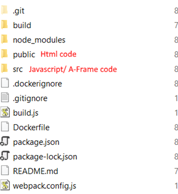

The ‘public’ folder contains the index.html file which is initially loaded when we the user enters to the web application.

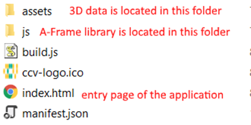

The A-Frame components are located in the ‘src’ folder:

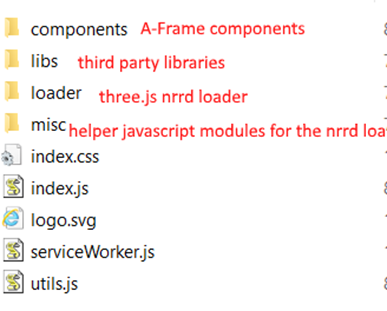

#### How to access it from the ccv server

Open your web browser and go to https://datasci.brown.edu/spheroid/ or https://datasci.brown.edu/simulation/.

The VR mode is only supported by Mozilla FireFox. Please install this application if you want to use HMD device to visualize the data.

#### How the application works

Once you open the application in a web browser, you can interact with the data in two different modes:
* 2D mode: Left click and drag your mouse from left to right or vice versa to rotate the data.
* 3D mode (use VR device): Two buttons are used to interact with the data

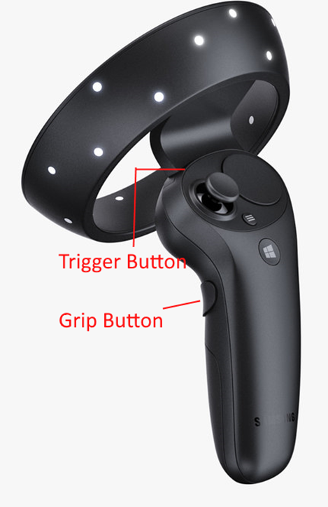

Trigger Button: Press it to drag and drop the data from one point to another. Use it to modify its position and rotation.
Grip Button: It clips the data. Press it and move the controller on any direction to see internal parts of the data from different points of view.

<a name="FireFoxVR"/>
#### Enable Mozilla Firefox VR

At this moment, VR on web browsers is only supported on Mozilla Firefox. In order to enable this option in your computer,please follow these steps:

1. Right Click onn your Desktop

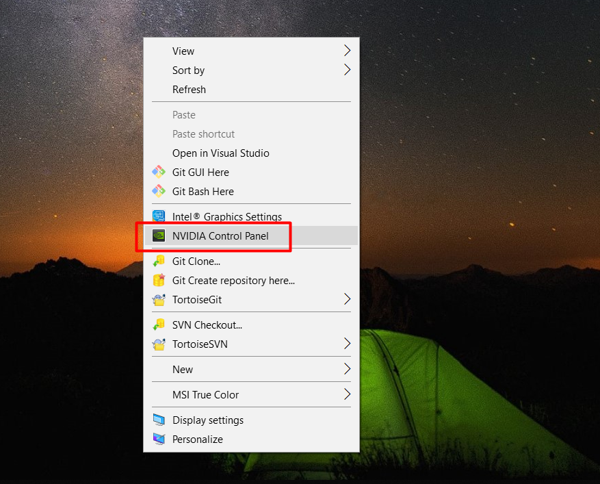

2. In the NVIDIA panel window, select the "Program Settings" Tab

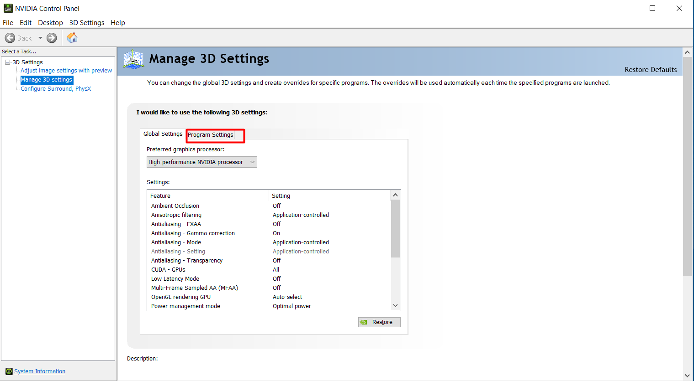

3. In the 'Select a program' drop list select the Mozilla Firefox (If you dont find it, you will have to click on the 'add' button, look for firefox.exe). In the 'Select the preferred graphics processor for this program' drop list select 'High-Perfomance NVIDIA processor'

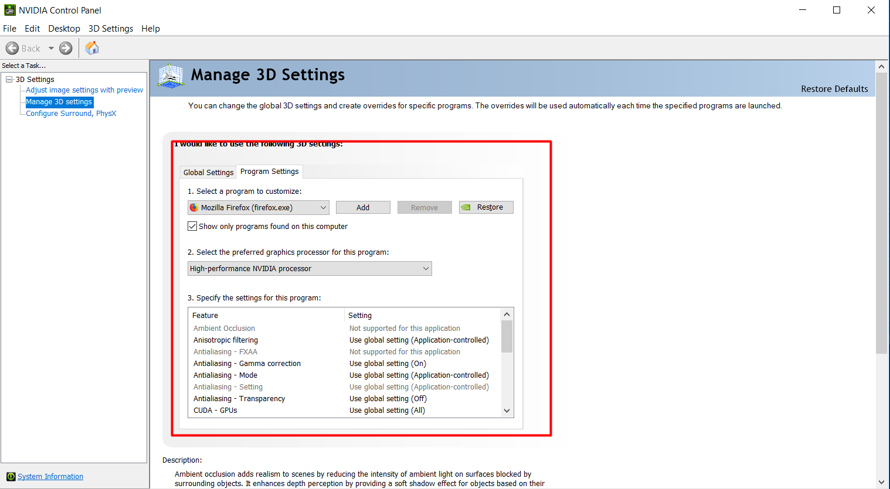
